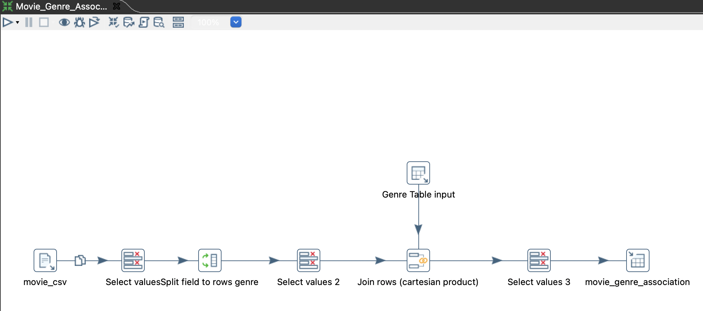

# Pentaho

## Transformaciones de datos

Pentaho Data Integration (PDI): Anteriormente conocido como Kettle, PDI es una herramienta de integración de datos que facilita la extracción, transformación y carga (ETL) de datos desde diversas fuentes hacia un almacén de datos o un sistema de análisis.



## Descarga de recursos

Puedes descargar pentaho PDI desde el sitio oficial: [Pentaho Community Edition](https://www.hitachivantara.com/es-latam/products/pentaho-platform/data-integration-analytics/pentaho-community-edition.html)

Una vez descargado pentaho pdi, correr el siguiente comando:

```sh
mkdir ~/PDI
mv data-integration ~/PDI
chmod +x ~/PDI/data-integration/spoon.sh
```

## Requisitos previos a iniciar la aplicación

Es necesario instalar Java 8 y configurar la variable de entorno JAVA_HOME con la ruta de la instalación.

En mac puedes usar brew para instalar java 8: 

```sh
brew install --cask adoptopenjdk8
```

En mac se requiere correr el siguiente comando en la terminal para poder iniciar pentaho:

```sh
env /usr/bin/arch -x86_64 /bin/zsh --login
```

## ¿Cómo iniciar pentaho en mac?

Ejecutar el siguiente comando en línea de comandos

```sh
sudo ~/PDI/data-integration/spoon.sh
```

## Scripts de transformación

Los scripts de base de datos se emplearán para cargar los archivos CSV de "movie lens" en el gestor de bases de datos PostgreSQL.
1. Movie.ktr
2. Genre.ktr
3. Movie_Genre_Association.ktr
4. Rating.ktr
5. Tag.ktr
6. Link.ktr
7. Genome_Tag.ktr
8. Genome_Score.ktr