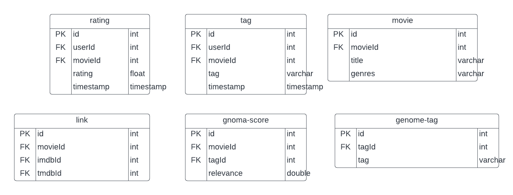

# Base de datos y sus relaciones

## Descripción de la actividad

Describir una base de datos y sus relaciones de manera no estructurada (puede ser un párrafo, lista esquema ...) con la que trabajar durante el tetramestre. Agrega el tipo de dato que supone que tendrá cada uno de tus atributos.

## Desarrollo de la actividad

### Vista general

Se tomo la desición de utilizar la siguiente base de datos: [Link](https://grouplens.org/datasets/movielens/).

Esta base de datos describe la calificación de 5 estrellas y los tags calificados en MovieLens, un servicio de recomendación de películas.

Contiene **25,000,095** clasificaciones y **1,093,360** aplicaciones de tags en **62,423** películas. Estos datos fueron creados por **162,541** usuarios entre el 9 de enero de 1995 y el 21 de noviembre de 2019. Este conjunto de datos se generó el 21 de noviembre de 2019.

Los usuarios fueron seleccionados al azar para su inclusión. Todos los usuarios seleccionados habían calificado al menos 20 películas. No se incluye información demográfica. Cada usuario está representado por una identificación y no se proporciona ninguna otra información.

### Descripción de base de datos

**Usuarios (Users)**

Los usuarios de MovieLens fueron seleccionados al azar para su inclusión. Sus identificaciones han sido anonimizadas. Los identificadores de usuario son consistentes entre ratings.csv y tags.csv (es decir, el mismo identificador se refiere al mismo usuario en los dos archivos).

**Calificación (Rating)**

Todas las calificaciones están contenidas en el archivo ratings.csv. Cada línea de este archivo después de la fila del encabezado representa una calificación de una película por parte de un usuario y tiene el siguiente formato:

- userId
- movieId
- rating
- timestamp

Las líneas dentro de este archivo están ordenadas primero por ID de usuario y luego, dentro de usuario, por ID de película.

Las calificaciones se realizan en una escala de 5 estrellas, con incrementos de media estrella (0,5 estrellas - 5,0 estrellas).

Las marcas de tiempo representan segundos desde la medianoche, hora universal coordinada (UTC) del 1 de enero de 1970.

**Etiquetas (Tags)**

Todas las etiquetas están contenidas en el archivo tags.csv. Cada línea de este archivo después de la fila del encabezado representa una etiqueta aplicada a una película por un usuario y tiene el siguiente formato:

 - userId
 - movieId
 - tag
 - timestamp

Las líneas dentro de este archivo están ordenadas primero por ID de usuario y luego, dentro de usuario, por ID de película.

Las etiquetas son metadatos generados por el usuario sobre películas. Cada etiqueta suele ser una sola palabra o frase corta. El significado, el valor y el propósito de una etiqueta en particular lo determina cada usuario.

Las marcas de tiempo representan segundos desde la medianoche, hora universal coordinada (UTC) del 1 de enero de 1970.

**Peliculas (Movies)**

En el conjunto de datos solo se incluyen películas con al menos una clasificación o etiqueta. Estos identificadores de películas son consistentes con los utilizados en el sitio web de MovieLens (por ejemplo, el identificador 1 corresponde a la URL https://movielens.org/movies/1 ). 

Los identificadores de películas son consistentes entre ratings.csv, tags.csv, movies.csv y links.csv (es decir, el mismo identificador se refiere a la misma película en estos cuatro archivos de datos).

La información de la película está contenida en el archivo movies.csv. Cada línea de este archivo después de la fila del encabezado representa una película y tiene el siguiente formato:

- movieId
- title
- genres

Los títulos de las películas se ingresan manualmente o se importan desde https://www.themoviedb.org/ e incluyen el año de lanzamiento entre paréntesis. Pueden existir errores e inconsistencias en estos títulos.

Los géneros son una lista separada por barras verticales y se seleccionan entre los siguientes:

- Acción
- Aventura
- Animación
- Para niños
- Comedia
- Delito
- Documental
- Drama
- Fantasía
- Cine negro
- Horror
- Musical
- Misterio
- Romance
- Ciencia ficción
- Suspenso
- Guerra
- occidental
- (no hay géneros listados)

**Enlaces (Links)**

El archivo contiene identificadores que se pueden utilizar para vincular a otras fuentes de datos de películas links.csv. Cada línea de este archivo después de la fila del encabezado representa una película y tiene el siguiente formato:

- movieId
- imdbId
- tmdbId

movieId es un identificador de películas utilizado por https://movielens.org . Por ejemplo, la película Toy Story tiene el enlace https://movielens.org/movies/1 .

imdbId es un identificador de películas utilizado por http://www.imdb.com . Por ejemplo, la película Toy Story tiene el enlace http://www.imdb.com/title/tt0114709/ .

tmdbId es un identificador de películas utilizado por https://www.themoviedb.org . Por ejemplo, la película Toy Story tiene el enlace https://www.themoviedb.org/movie/862 .

El uso de los recursos enumerados anteriormente está sujeto a los términos de cada proveedor.

**Genoma puntuaciones y genoma etiquetas**

Este conjunto de datos incluye una copia actual del **Tag Genome**.

El **genoma de etiquetas** es una estructura de datos que contiene **puntuaciones** de relevancia de etiquetas para películas. La estructura es una matriz densa: cada película del genoma tiene un valor para cada etiqueta del genoma.

El **genoma de etiquetas** codifica con qué fuerza las películas exhiben propiedades particulares representadas por etiquetas (atmosféricas, estimulantes, realistas, etc.). El genoma de la etiqueta se calculó utilizando un algoritmo de aprendizaje automático en contenido aportado por el usuario, incluidas etiquetas, calificaciones y reseñas textuales.

El genoma se divide en dos archivos. El archivo genome-scores.csv contiene datos de relevancia de etiquetas de película en el siguiente formato:

- movieId
- tagId
- relevance

El segundo archivo, genome-tags.csv proporciona las descripciones de las etiquetas para los ID de etiqueta en el archivo del genoma, en el siguiente formato:

- tagId
- tag

Los valores tagId se generan cuando se exporta el conjunto de datos, por lo que pueden variar de una versión a otra de los conjuntos de datos de MovieLens.

## Estructura de datos

## Citas

Jesse Vig, Shilad Sen, and John Riedl. 2012. The Tag Genome: Encoding Community Knowledge to Support Novel Interaction. ACM Trans. Interact. Intell. Syst. 2, 3: 13:1–13:44. https://doi.org/10.1145/2362394.2362395