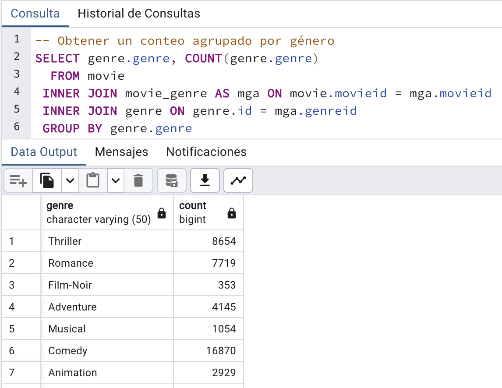
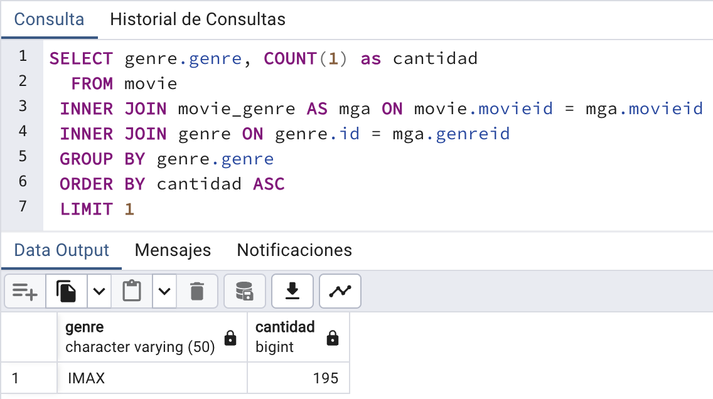
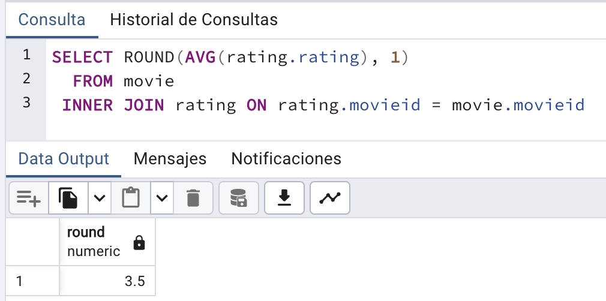
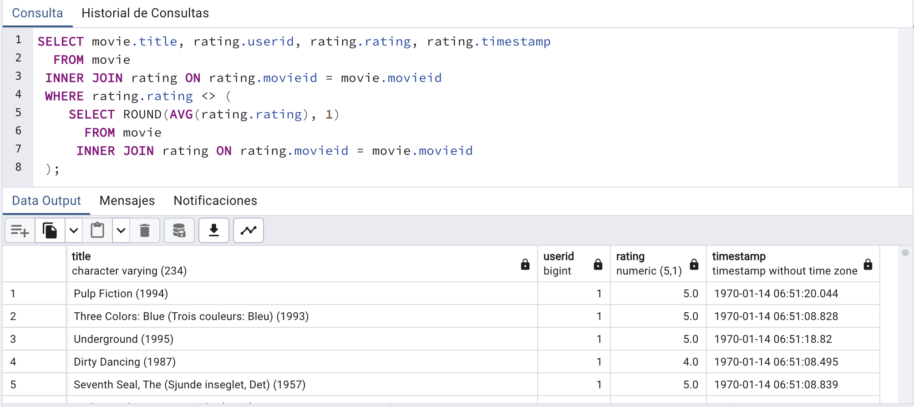
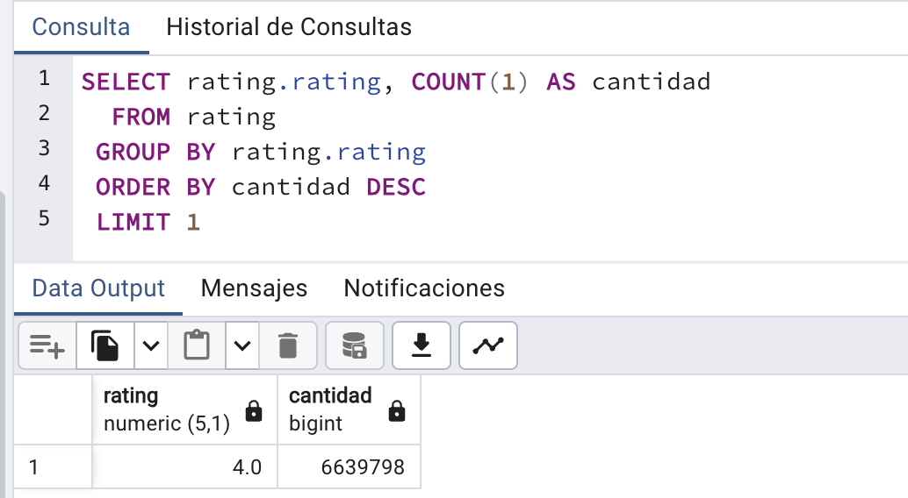

# Tarea 5

## Descripción de la actividad

1. Usar funciones de agregación para calcular
    
- Conteo de frecuencias o media  
- Mínimos o máximos
- Cuantil cuyo resultado sea distinto a la media
- Moda  
- Reporta hallazgos, dificultades, implementación de soluciones encontradas en línea.

2. Haz al menos un ejemplo de cada una de estas consultas de estadísticos

## Desarrollo de la actividad

### 1. Conteo de frecuencias o media

``` sql
-- Obtener un conteo agrupado por género
SELECT genre.genre, COUNT(genre.genre)
  FROM movie
 INNER JOIN movie_genre AS mga ON movie.movieid = mga.movieid
 INNER JOIN genre ON genre.id = mga.genreid
 GROUP BY genre.genre
```



### 2. Mínimos o máximos

``` sql
-- Obtener el conteo más pequeño de los géneros
SELECT genre.genre, COUNT(1) as cantidad
  FROM movie
 INNER JOIN movie_genre AS mga ON movie.movieid = mga.movieid
 INNER JOIN genre ON genre.id = mga.genreid
 GROUP BY genre.genre
 ORDER BY cantidad ASC
 LIMIT 1
```


### 3. Cuantil cuyo resultado sea distinto a la media

``` sql
-- Consultar las peliculas cuyo raing es distinto a la media
SELECT movie.title, rating.userid, rating.rating, rating.timestamp
  FROM movie
 INNER JOIN rating ON rating.movieid = movie.movieid
 WHERE rating.rating <> (
	SELECT ROUND(AVG(rating.rating), 1)
	  FROM movie
	 INNER JOIN rating ON rating.movieid = movie.movieid
 );
```




### 4. Moda

``` sql
-- Moda
SELECT rating.rating, COUNT(1) AS cantidad
  FROM rating
 GROUP BY rating.rating
 ORDER BY cantidad DESC
 LIMIT 1
```

