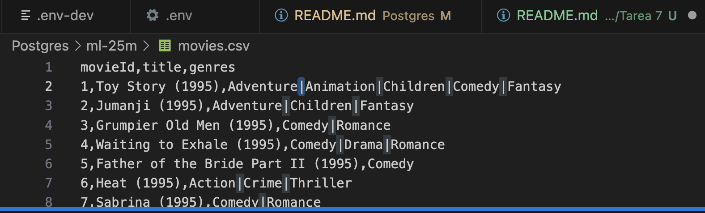
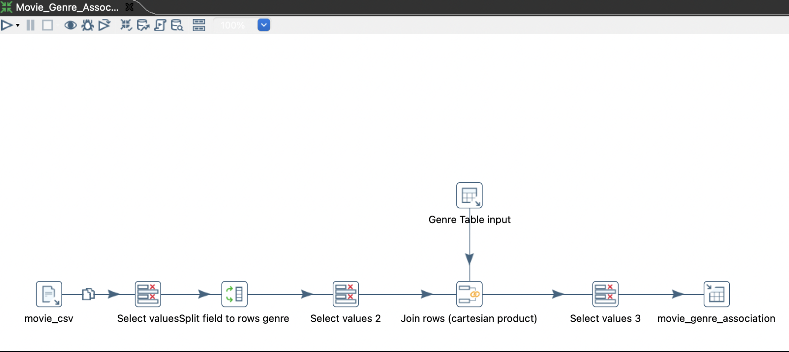
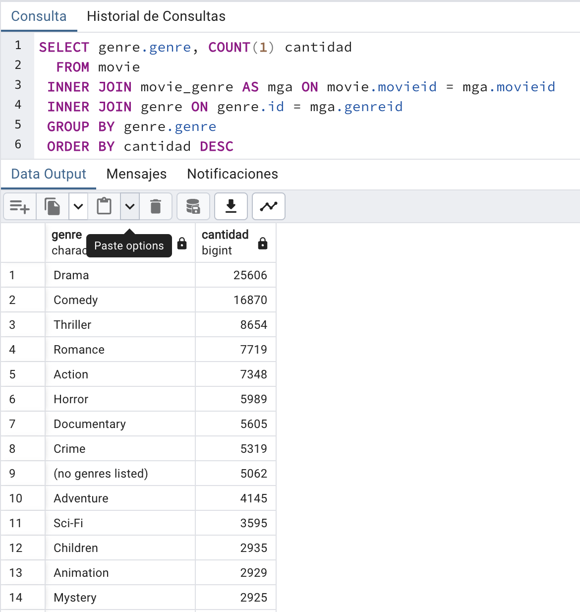

# Tarea 7

## Descripción de la actividad

1. Revisar inconsistencias en tu base de datos.
2. Haz modificaciones o ajustes que faciliten la manipulación de tu base de datos usando lenguaje SQL.
3. Utiliza subconsultas para responder preguntas relevantes de tus datos.
4. Reporta hallazgos.

## Desarrollo de la actividad

### Reporte

Al explorar las diferentes tablas que componen mi base de datos de calificaciones de peliculas, pude observar que había una tabla la cual no estaba normalizada. 

La tabla de `movies` contiene la columna compuesta de `genres` la cual pudiera dificultar encontrar información de forma categórica.

Presento una muestra de como se encontraba originalmente los datos.



Se aplicaron algunas transformaciones de datos usando la herramienta de pentaho para separar esta columna compuesta en otra entidad de base datos que pudiera tener los elementos sin repeticiones y así manejar la columna mediante una identificador.



Al aplicar estas modificaciones me pertio hacer consultas más flexibles respecto al género de las peliculas.

```sql
SELECT genre.genre, COUNT(1) cantidad
  FROM movie
 INNER JOIN movie_genre AS mga ON movie.movieid = mga.movieid
 INNER JOIN genre ON genre.id = mga.genreid
 GROUP BY genre.genre
 ORDER BY cantidad DESC
```

